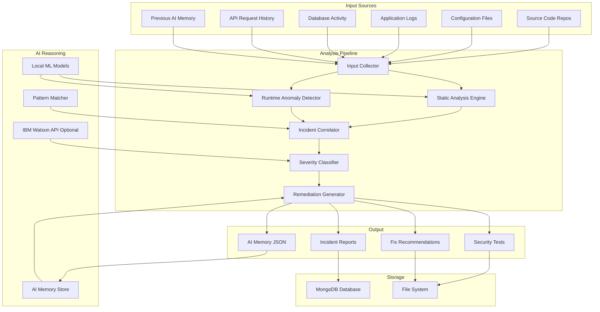
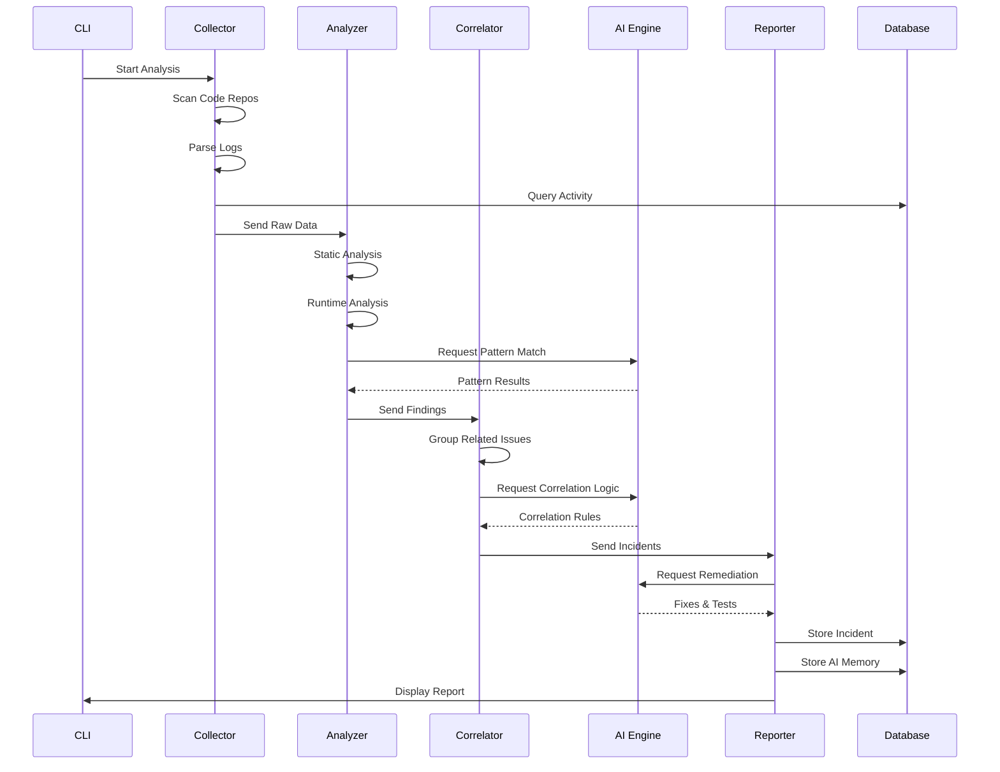

# AI-Powered Security Analyst System Architecture

## System Overview

This document outlines the architecture for an automated anomaly detection and data leak prevention system powered by AI reasoning.

## Technology Stack

- **Backend Framework**: Python Flask
- **Database**: MongoDB (with SQLite fallback option)
- **AI Engine**: Hybrid approach (local ML + optional IBM Watson API)
- **Interface**: CLI-based
- **Analysis Libraries**: 
  - `bandit` for Python security analysis
  - `semgrep` for pattern-based code scanning
  - `regex` for custom secret detection
  - `scikit-learn` for anomaly detection
  - `pandas` for log analysis

## High-Level Architecture



## Component Details

### 1. Input Collector
**Purpose**: Gather data from multiple sources for analysis

**Responsibilities**:
- Scan source code repositories recursively
- Parse configuration files (JSON, YAML, ENV, INI)
- Read and parse log files with timestamp extraction
- Query mock database for activity patterns
- Load API request history from logs or database
- Retrieve previous AI security memory

**Key Files**:
- `collectors/code_collector.py`
- `collectors/log_collector.py`
- `collectors/db_collector.py`
- `collectors/api_collector.py`

### 2. Static Analysis Engine
**Purpose**: Detect hardcoded secrets and security vulnerabilities in code

**Detection Patterns**:
- API keys (AWS, Google, Stripe, etc.)
- SSH private keys (RSA, ED25519)
- Database credentials (connection strings, passwords)
- OAuth tokens and JWT secrets
- Debug mode enabled in production
- Sensitive data in comments
- Weak cryptographic implementations
- Deprecated API usage
- Abandoned modules and unused code

**Key Files**:
- `analyzers/static_analyzer.py`
- `analyzers/secret_detector.py`
- `analyzers/deprecated_api_detector.py`
- `patterns/secret_patterns.json`

### 3. Runtime Anomaly Detector
**Purpose**: Identify suspicious behavior patterns in logs and API activity

**Detection Capabilities**:
- Unusual API traffic volume or frequency
- Failed authentication attempts (brute force indicators)
- Access to deprecated endpoints
- Abnormal database query patterns
- Large data export operations
- Suspicious geographic access patterns
- Time-based anomalies (off-hours access)
- Privilege escalation attempts

**Key Files**:
- `analyzers/runtime_analyzer.py`
- `analyzers/anomaly_detector.py`
- `models/baseline_models.pkl`

### 4. Incident Correlator
**Purpose**: Group related findings into unified incidents

**Correlation Logic**:
- Temporal correlation (events within time window)
- Credential correlation (same API key used across multiple files)
- Target correlation (same database table or endpoint)
- User/IP correlation (same actor across multiple actions)
- Attack chain correlation (sequential attack stages)

**Key Files**:
- `correlators/incident_correlator.py`
- `correlators/attack_chain_detector.py`

### 5. Severity Classifier
**Purpose**: Assign severity levels (1-5) to each incident

**Classification Criteria**:
- **Level 1 (Informational)**: Technical debt, no security impact
- **Level 2 (Low)**: Potential risk, no sensitive data involved
- **Level 3 (Medium)**: Sensitive area affected, no active exploitation
- **Level 4 (High)**: Leaked secret or weak authentication detected
- **Level 5 (Critical)**: Active attack or data exfiltration in progress

**Key Files**:
- `classifiers/severity_classifier.py`
- `classifiers/risk_scorer.py`

### 6. Remediation Generator
**Purpose**: Produce specific, actionable fixes for each incident

**Output Types**:
- Immediate containment actions
- Code patches with before/after examples
- Configuration changes
- Secret rotation procedures
- API deprecation steps
- Database access restrictions
- Security test specifications

**Key Files**:
- `remediators/fix_generator.py`
- `remediators/test_generator.py`
- `templates/fix_templates.json`

### 7. AI Reasoning Engine
**Purpose**: Provide intelligent analysis and decision-making

**Components**:
- **Local ML Models**: Trained on common attack patterns
- **Pattern Matcher**: Rule-based detection for known vulnerabilities
- **IBM Watson Integration**: Optional cloud-based AI analysis
- **AI Memory Store**: JSON-based knowledge base for prevention

**Key Files**:
- `ai_engine/reasoning_engine.py`
- `ai_engine/ibm_watson_client.py`
- `ai_engine/memory_manager.py`
- `ai_engine/pattern_library.py`

### 8. Report Generator
**Purpose**: Create comprehensive incident documentation

**Report Sections**:
- Executive Summary
- Detected Incidents (with evidence)
- Correlated Findings
- Recommended Fixes
- Generated Security Tests
- Incident Timeline
- AI Memory Output

**Key Files**:
- `reporters/incident_reporter.py`
- `reporters/report_formatter.py`
- `templates/report_template.html`

## Data Flow



## Mock Data Structure

### Mock Vulnerable Repository Structure
```
mock_repos/
├── ecommerce_app/
│   ├── src/
│   │   ├── config.py          # Hardcoded DB credentials
│   │   ├── api_keys.py        # Exposed API keys
│   │   ├── auth.py            # Weak authentication
│   │   └── deprecated_api.py  # Old unused endpoints
│   ├── logs/
│   │   ├── app.log            # Sensitive data in logs
│   │   └── access.log         # Suspicious access patterns
│   └── .env.example           # Accidentally committed secrets
├── payment_service/
│   ├── src/
│   │   ├── stripe_handler.py  # Leaked Stripe key
│   │   └── database.py        # SQL injection vulnerability
│   └── abandoned/             # Unused modules
└── user_service/
    ├── src/
    │   ├── ssh_keys/          # Committed private keys
    │   └── jwt_handler.py     # Weak JWT secret
    └── logs/
        └── security.log       # Failed auth attempts
```

### Mock Log Patterns
```
# Normal Activity
2026-05-15 10:23:45 INFO User login successful user_id=1234
2026-05-15 10:24:12 INFO API request GET /api/products status=200

# Suspicious Activity
2026-05-15 02:15:33 WARN Failed login attempt user=admin ip=192.168.1.100
2026-05-15 02:15:35 WARN Failed login attempt user=admin ip=192.168.1.100
2026-05-15 02:15:37 WARN Failed login attempt user=admin ip=192.168.1.100
2026-05-15 02:16:01 INFO User login successful user=admin ip=192.168.1.100
2026-05-15 02:16:15 INFO Database export initiated table=users rows=50000
2026-05-15 02:17:22 INFO API request GET /api/deprecated/v1/users status=200
```

### Mock Database Schema
```javascript
// MongoDB Collections

// incidents
{
  _id: ObjectId,
  incident_id: "INC-2026-001",
  title: "Leaked AWS Credentials in Configuration File",
  severity: 5,
  attack_type: "credential_leak",
  detected_at: ISODate,
  affected_files: ["src/config.py", "src/aws_handler.py"],
  evidence: [...],
  status: "open",
  remediation: {...}
}

// api_requests
{
  _id: ObjectId,
  timestamp: ISODate,
  endpoint: "/api/users",
  method: "GET",
  status_code: 200,
  user_id: "user123",
  ip_address: "192.168.1.100",
  response_time_ms: 45
}

// ai_memory
{
  _id: ObjectId,
  memory_type: "security_prevention_rule",
  incident_pattern: "Hardcoded AWS credentials in Python config files",
  root_cause: "Developers committing secrets to version control",
  signals_to_watch: ["AWS_ACCESS_KEY_ID", "AWS_SECRET_ACCESS_KEY"],
  prevention_rule: "Scan all Python files for AWS credential patterns",
  created_at: ISODate
}
```

## Attack Scenarios

### Scenario 1: Coordinated Credential Theft
**Timeline**:
1. Attacker discovers leaked AWS key in config file
2. Uses key to access S3 bucket
3. Downloads customer database backup
4. Attempts to access admin panel with stolen credentials
5. Exports user data via deprecated API

**Expected Detection**:
- Static analysis finds hardcoded AWS key
- Runtime detector flags unusual S3 API calls
- Log analysis shows admin access from suspicious IP
- Correlator groups all events into single incident
- Severity: Level 5 (Critical)

### Scenario 2: Abandoned API Exploitation
**Timeline**:
1. Attacker scans for deprecated endpoints
2. Finds old API v1 with weak authentication
3. Bypasses rate limiting on deprecated endpoint
4. Extracts sensitive user data
5. Attempts privilege escalation

**Expected Detection**:
- Deprecated API detector finds unused v1 endpoints
- Runtime analysis shows repeated calls to old API
- Anomaly detector flags unusual data volume
- Correlator links deprecated API to data exfiltration
- Severity: Level 4 (High)

### Scenario 3: Multi-Vector Database Attack
**Timeline**:
1. SQL injection vulnerability in payment service
2. Attacker gains database read access
3. Discovers hardcoded DB credentials in code
4. Uses credentials for direct database connection
5. Performs large-scale data export

**Expected Detection**:
- Static analysis finds hardcoded DB credentials
- Runtime detector flags abnormal query patterns
- Log analysis shows large data exports
- Correlator identifies coordinated attack
- Severity: Level 5 (Critical)

## CLI Interface Design

```bash
# Run full security analysis
python security_analyst.py analyze --path ./mock_repos

# Analyze specific repository
python security_analyst.py analyze --path ./mock_repos/ecommerce_app

# Analyze with IBM Watson integration
python security_analyst.py analyze --path ./mock_repos --use-ibm-watson

# Generate incident report
python security_analyst.py report --incident-id INC-2026-001

# View AI memory
python security_analyst.py memory --list

# Run security tests
python security_analyst.py test --path ./mock_repos

# Export findings
python security_analyst.py export --format json --output findings.json
```

## Configuration

```yaml
# config.yaml
database:
  type: mongodb  # or sqlite
  host: localhost
  port: 27017
  name: security_analyst

analysis:
  static_analysis:
    enabled: true
    scan_patterns:
      - "*.py"
      - "*.js"
      - "*.java"
      - "*.env"
      - "*.config"
  
  runtime_analysis:
    enabled: true
    anomaly_threshold: 0.85
    time_window_minutes: 60
  
  correlation:
    enabled: true
    time_window_minutes: 120
    min_confidence: 0.7

ai_engine:
  local_models:
    enabled: true
    model_path: "./models"
  
  ibm_watson:
    enabled: false
    api_key: "${IBM_WATSON_API_KEY}"
    url: "${IBM_WATSON_URL}"

reporting:
  output_format: "markdown"  # or html, json
  include_code_snippets: true
  max_snippet_lines: 20

logging:
  level: INFO
  file: "./logs/security_analyst.log"
```

## Security Considerations

1. **Sensitive Data Handling**: Never log actual secrets found during analysis
2. **Access Control**: Restrict access to incident reports and AI memory
3. **API Key Management**: Store IBM Watson credentials securely
4. **Database Security**: Use authentication for MongoDB connections
5. **Audit Trail**: Log all analysis operations and report access

## Performance Optimization

1. **Parallel Processing**: Analyze multiple files concurrently
2. **Caching**: Cache analysis results for unchanged files
3. **Incremental Analysis**: Only scan modified files in subsequent runs
4. **Database Indexing**: Index MongoDB collections for fast queries
5. **Memory Management**: Stream large log files instead of loading entirely

## Testing Strategy

1. **Unit Tests**: Test individual analyzers and detectors
2. **Integration Tests**: Test full analysis pipeline
3. **Attack Scenario Tests**: Verify detection of coordinated attacks
4. **Performance Tests**: Ensure analysis completes within time limits
5. **False Positive Tests**: Validate accuracy of detection algorithms

## Future Enhancements

1. Real-time monitoring with webhook integration
2. Web dashboard for visualization
3. Integration with CI/CD pipelines
4. Automated remediation with pull request generation
5. Machine learning model training on historical incidents
6. Multi-language support beyond Python
7. Cloud deployment options (AWS, Azure, GCP)
8. Integration with SIEM systems
9. Compliance reporting (GDPR, SOC2, ISO27001)
10. Threat intelligence feed integration